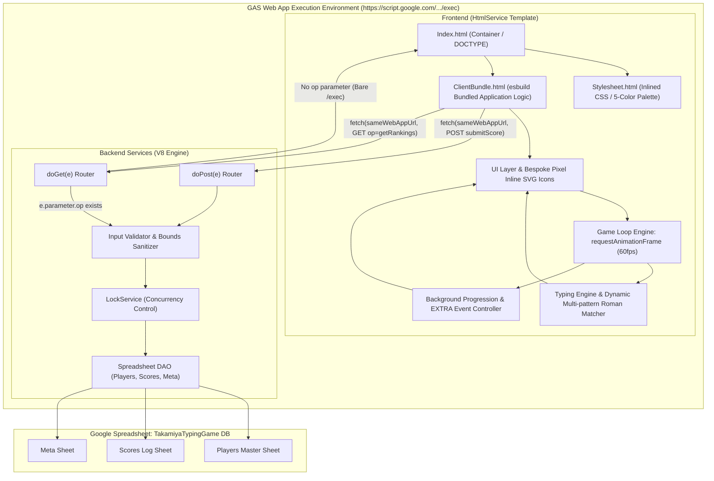

# 03_architecture.md — 基本設計・アーキテクチャ設計書

## 1. システム全体構成 (System Architecture)

本システムは、Google Apps Script (GAS) Web App の単一URLより配信される高レスポンスな2Dタイピングゲームフロントエンド（HtmlService）と、スコア永続化およびランキング集計を担当する同GASバックエンド、およびGoogle Spreadsheetデータストア（`TakamiyaTypingGame DB`）で構成されます。



---

## 2. 責務境界 & 通信プロトコル (Responsibility Boundary & Protocol)

### 2.1 レイヤー別責務分担

| レイヤー | 実行ホスト / 基盤 | 担当責務 | 厳禁事項 |
| :--- | :--- | :--- | :--- |
| **Frontend** | PCブラウザ (GAS HtmlService iframe) | ・60fps ゲームループ描画<br>・Keydown直接捕捉 & 動的ローマ字揺れ判定<br>・英数/ASCII混在語のcase-insensitive判定<br>・動的走行時間モデル（文字数連動タイマー）<br>・自作ピクセルインラインSVGアイコン表示<br>・フォークリフト・資材・車両アニメーション<br>・15tトラック上方補正 & 難易度別MISS資材落下<br>・背景建設 & EXTRA演出制御<br>・Global Game Timer & Per-Question Forklift Timer 計算 | ・1キー入力ごとの通信<br>・Spreadsheetへの直接アクセス<br>・フレーム単位の重いDOM生成破棄<br>・OS/Unicode絵文字の使用 |
| **Backend (GAS)** | Google Apps Script (V8 Engine) | ・`doGet`: Bareアクセス時Frontend HTML配信 / `op`指定時JSONデータ（health, getPlayers, getRankings）返却<br>・`doPost`: スコア登録受付、パラメータ検証、数式エスケープ、LockService排他制御 | ・常時リアルタイムWebSocket通信<br>・重い物理演算やグラフィックス処理 |
| **Data Store** | Google Spreadsheet (`TakamiyaTypingGame DB`) | ・Players マスタ保存<br>・Scores 履歴の追記保存（監査・履歴保持）<br>・ランキング算出元データ | ・クライアントへの無制限公開 |

### 2.2 `doGet(e)` ルーティング仕様
Google Apps Script の `doGet(e)` は、フロントエンド提供と既存 JSON REST API の双方を同一エンドポイントで安全に処理します。

```text
doGet(e)
│
├─ e.parameter.op exists
│    ├─ health      --> JSON { ok: true, data: { service: "TAKAMIYA_TYPING_GAME_BACKEND", ... } }
│    ├─ getPlayers  --> JSON { ok: true, data: { players: [...] } }
│    └─ getRankings --> JSON { ok: true, data: { rankings: [...] } }
│
└─ no op (Bare /exec)
     └─ HtmlService.createTemplateFromFile("Index").evaluate()
```

---

## 3. Frontend GAS ビルドパイプライン (Deterministic Build)

ESモジュール群で開発される `src/` を手作業でGASへコピーすることは禁止されています。
`scripts/buildGasFrontend.js` により、一貫したビルドアーティファクトを自動生成します。

```text
src/
  ├── main.js ────────( esbuild bundle )───────▶ backend/gas/ClientBundle.html (<script>...</script>)
  ├── index.css ──────( inlined CSS )──────────▶ backend/gas/Stylesheet.html (<style>...</style>)
  └── index.html ─────( template assemble )────▶ backend/gas/Index.html (<?!= include(...) ?>)
```

* **コマンド**: `npm run build:gas`
* **整合性検証**: バンドル内に未解決の `import` 文やローカル相対パス、GitHub Pages 依存が存在しないことを自動テスト（`tests/testGasBuild.js`）で検証。

---

## 4. Production SSOT マトリクス

| 領域 (Domain) | Authoritative SSOT | 補足・同期ルール |
| :--- | :--- | :--- |
| **App Source** | Git Repository (`src/`) | すべての機能・UI・ロジックの正本 |
| **Production Frontend Runtime** | GAS Web App (`/exec` HtmlService) | 単一URLより利用者へ配信 |
| **Frontend Build Source** | `src/` | 開発環境の第一級ソースコード |
| **GAS Deployment Artifact** | `backend/gas/` generated bundles | `buildGasFrontend.js` で決定論的に生成 |
| **Backend Source** | Git Repository (`backend/gas/`) | GAS サーバーサイドコードの正本 |
| **Backend Runtime** | same GAS Web App | Frontend と同一の Web App デプロイ |
| **Database** | Google Spreadsheet (`TakamiyaTypingGame DB`) | ID: `1-HUuzXK27t2eRJEwgSMVO1bNVkVRwVTyzb4LftW5TX8` |
| **Question Master** | CSV v3 (`data/questions/takamiya-typing-game-master-v3.csv`) | 180問の出題語句・読み・ストロークの正本 |
| **Release Identity** | Git Tag (`v1.1.0`) | コミットとリリースバージョンの対応付け |

---

## 5. セキュリティ & 信頼境界 (Security Boundary)

1. `PLAYER_NAME_IS_NOT_AUTHENTICATION`:
   - プレイヤー名入力は「誰のスコアとして記録するか」を指定する自由入力表示名であり、パスワード等の本人認証ではありません。
2. `SAME_NORMALIZED_NAME_MEANS_SAME_PLAYER`:
   - 大文字小文字・空白を正規化したキー（`PlayerNameKey`）が一致する名前は、別ブラウザからでも同一PlayerIDへ紐付けます。
3. `ANONYMOUS_WEB_APP_ENDPOINT`:
   - Web App は「全員（匿名を含む）」に公開され、社内PCからGoogleログインなしで即時プレイ可能です。
4. `WEB_APP_URL_IS_NOT_A_SECRET`:
   - Web App URL はフロントエンド配信URLそのものであり、秘匿情報ではありません。
5. `RANKING_PLAYER_NAMES_ARE_VISIBLE_TO_ENDPOINT_CALLERS`:
   - ランキング取得APIは公開用情報（順位、プレイヤー名、スコア、正確率、コンボ）のみを返却し、内部IDやシステム情報は返却しません。
