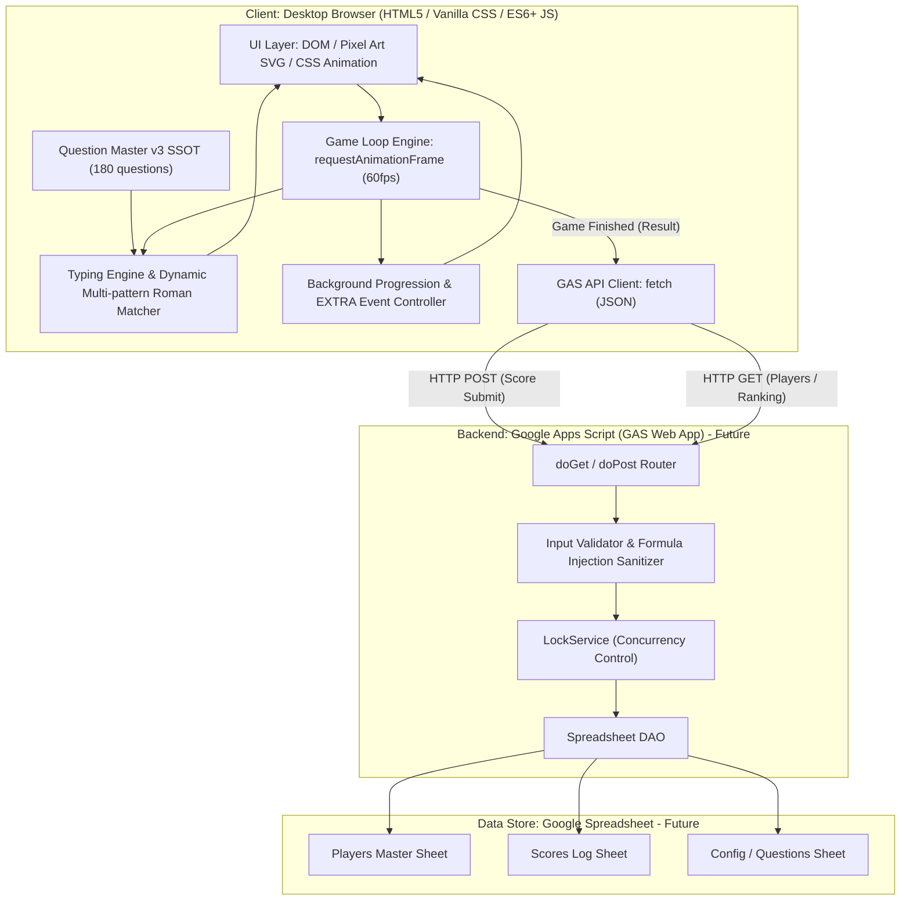

# 03_architecture.md — 基本設計・アーキテクチャ設計書

## 1. システム全体構成 (System Architecture)

本システムは、ブラウザ側で完結する高レスポンスな2Dタイピングゲームフロントエンドと、スコア永続化およびランキング集計を担当するGoogle Apps Script (GAS) バックエンド、およびGoogle Spreadsheetデータストアで構成される（※GASおよびSpreadsheetは現在は未作成）。



---

## 2. 責務境界 & 通信プロトコル (Responsibility Boundary & Protocol)

### 2.1 レイヤー別責務分担

| レイヤー | 実行ホスト / 基盤 | 担当責務 | 厳禁事項 |
| :--- | :--- | :--- | :--- |
| **Frontend** | PCブラウザ (Chrome / Edge / Firefox) | ・60fps ゲームループ描画<br>・Keydown直接捕捉 & 動的ローマ字揺れ判定<br>・英数/ASCII混在語のcase-insensitive判定<br>・動的走行時間モデル（文字数連動タイマー）<br>・フォークリフト・資材・車両アニメーション<br>・背景建設 & EXTRA演出制御<br>・Global Game Timer & Per-Question Forklift Timer 計算 | ・1キー入力ごとの通信<br>・Spreadsheetへの直接アクセス<br>・フレーム単位の重いDOM生成破棄 |
| **Backend (GAS)** | Google Apps Script (V8 Engine) ※将来 | ・`doGet`: 初期マスター（Players/Questions/Config）、ランキングデータ返却<br>・`doPost`: スコア登録受付、パラメータ検証、数式エスケープ、LockService排他制御 | ・常時リアルタイムWebSocket通信<br>・重い物理演算やグラフィックス処理 |
| **Data Store** | Google Spreadsheet ※将来 | ・Players マスタ保存<br>・Scores 履歴の追記保存（監査・履歴保持）<br>・ランキング算出元データ | ・クライアントへの無制限公開 |

### 2.2 API 通信仕様 (JSON Endpoints)

#### A. 初期マスター取得 (`GET ?action=getMasterData`)
* **Request**: `GET https://script.google.com/macros/s/{DEPLOY_ID}/exec?action=getMasterData`
* **Response**:
```json
{
  "success": true,
  "players": [
    { "id": "PL-001", "name": "足場 太郎", "department": "機材管理部" },
    { "id": "PL-002", "name": "現場 次郎", "department": "安全推進部" }
  ],
  "serverTime": "2026-09-02T11:00:00Z"
}
```

#### B. スコア登録 (`POST`)
* **Request**: `POST https://script.google.com/macros/s/{DEPLOY_ID}/exec`
* **Transport**: `Content-Type: text/plain;charset=utf-8` (GAS Web App CORS preflight 回避用 Simple Request)
* **Payload**:
```json
{
  "op": "submitScore",
  "data": {
    "submissionId": "SUB-1788470000000-8472",
    "playerName": "山田 太郎",
    "mode": "PRODUCTION",
    "difficulty": "INTERMEDIATE",
    "score": 18450,
    "correctCount": 22,
    "typedCharacters": 185,
    "typingMistakes": 3,
    "missCount": 1,
    "accuracy": 98.38,
    "maxCombo": 16,
    "wpm": 38.5,
    "kpm": 192.5,
    "reachedStage": "HIGHRISE",
    "startedAt": "2026-09-04T07:00:00.000Z",
    "finishedAt": "2026-09-04T07:01:30.000Z",
    "appVersion": "1.0.0"
  }
}
```
* **Response**:
```json
{
  "ok": true,
  "data": {
    "scoreId": "SC-1788470000123-9182",
    "duplicate": false,
    "playerName": "山田 太郎",
    "score": 18450,
    "difficulty": "INTERMEDIATE",
    "playedAt": "2026-09-04T16:01:30+09:00",
    "player": {
      "playerId": "PL-1788470000000-4821",
      "playerName": "山田 太郎"
    }
  }
}
```
  "rankAllTime": 5,
  "message": "スコアを正常に登録しました。"
}
```

#### C. ランキング取得 (`GET ?action=getRankings&difficulty=intermediate&period=monthly`)
* **Request**: `GET https://script.google.com/macros/s/{DEPLOY_ID}/exec?action=getRankings&difficulty=intermediate&period=monthly`
* **Response**:
```json
{
  "success": true,
  "period": "monthly",
  "difficulty": "intermediate",
  "rankings": [
    { "rank": 1, "playerId": "PL-003", "playerName": "積込 花子", "score": 14200, "accuracy": 99.1, "playedAt": "2026-09-01T15:20:00Z" },
    { "rank": 2, "playerId": "PL-001", "playerName": "足場 太郎", "score": 12500, "accuracy": 97.56, "playedAt": "2026-09-02T11:00:00Z" }
  ]
}
```

---

## 3. ゲーム状態遷移 & タイマー制御構造 (State Machines & Timing)

### 3.1 ゲーム全体ライフサイクル状態マシン (Global Game Timer)
```text
[INIT] ──(マスター読込完了)──> [READY_TITLE]
                                      │
                         (プレイヤー&難易度選択)
                                      ▼
                               [COUNTDOWN (3..2..1)]
                                      │
                                      ▼
                                [PLAYING_ACTIVE] (Global Timer: 90s カウントダウン)
                                      │
                   ┌──────────────────┴──────────────────┐
                   ▼                                     ▼
        (Global Timer = 0 到達)                     (手動中断)
                   ▼                                     ▼
           [GAME_OVER_RESULT]                       [READY_TITLE]
                   │
         (スコア送信 / ランキング確認)
                   ▼
             [RANKING_VIEW] ──(閉じる)──> [READY_TITLE]
```

### 3.2 1問単位のタイピング & 走行アニメーション状態マシン (Per-Question Forklift Timer)
```text
[SPAWN_QUESTION] ──(文字数連動 allowedTime 算出)──> [DRIVING_FORWARD] (Forklift Timer カウントダウン)
                                                               │
               ┌───────────────────────────────────────────────┴───────────────────────────────────────────────┐
               ▼                                                                                               ▼
 (Per-Question Timer満了前に入力完了)                                                            (入力完了前にPer-Question Timer満了)
               ▼                                                                                               ▼
       [SUCCESS_LIFTING]                                                                               [MISS_COLLISION]
               │                                                                                               │
        (荷台移動 250ms)                                                                                (車体振動 200ms)
               ▼                                                                                               ▼
       [SUCCESS_POPUP] (200ms)                                                                         [MISS_DROP_PENALTY] (300ms)
               │                                                                                               │
     (SCORE/COMBO/背景加算)                                                                         (COMBOリセット/Global Timer減算)
               │                                                                                               │
               └───────────────────────────────────────────────┬───────────────────────────────────────────────┘
                                                               ▼
                                                      [SPAWN_NEXT_QUESTION]
```

---

## 4. セキュリティ & 整合性設計 (Security & Integrity)

1. **Spreadsheet Formula Injection 対策**:
   - プレイヤー名、問題文、テキストデータが `=`, `+`, `-`, `@` で始まる場合、先頭にシングルクォート `'` を付与して無害化してからSpreadsheetへ格納。
2. **GAS 側パラメータ検証**:
   - `score`, `correctCount`, `missCount`, `accuracy`, `playDuration` の型および上限・下限範囲チェック（例: `accuracy` は 0〜100、負のスコアや異常値の排除）。
3. **LockService による排他制御**:
   - `doPost` 処理開始時に `LockService.getScriptLock().waitLock(10000)` を実行し、複数クライアントからの同時スコア送信による行上書き競合を完全に防止。
4. **CORS 対応**:
   - GAS Web Appのレスポンスに `ContentService.createTextOutput().setMimeType(ContentService.MimeType.JSON)` を適用。

---

## 5. モジュール & ディレクトリ構成 (Directory & Module Structure)

```text
base-typing-game/
├── .github/
│   └── workflows/
│       └── deploy.yml              # GitHub Pages 自動デプロイ設定
├── data/                           # Content SSOT データディレクトリ
│   └── questions/
│       └── takamiya-typing-game-master-v3.csv  # 正式問題マスター (180問)
├── docs/                           # プロジェクト公式ドキュメント
├── src/                            # ※実装フェーズで作成予定
│   ├── index.html                  # メインHTMLエントリポイント
│   ├── index.css                   # Pixel Artデザインシステム・レイアウトスタイル
│   ├── main.js                     # アプリケーション初期化・画面ルーティング
│   ├── config/
│   │   └── gameConfig.js           # ゲームバランス・動的走行時間・難易度設定
│   ├── data/
│   │   └── defaultQuestions.js     # CSVからバンドルされた問題マスターJS
│   ├── engine/
│   │   ├── gameEngine.js           # 60fps ゲームループ・2種タイマー・スコア制御
│   │   ├── typingMatcher.js        # ローマ字表記揺れ・英数混在語判定パーサー
│   │   └── animationController.js  # フォークリフト走行・積込・接触アニメーション
│   ├── assets/
│   │   ├── pixelSprites.js         # 車両・資材・ランドマークのSVG/Pixel定義
│   │   └── extraEffects.js         # EXTRAステージ動的演出 (飛行機・ヘリ・風船等)
│   ├── services/
│   │   └── gasApiClient.js         # GAS通信 (マスター取得・スコア送信・ランキング)
│   └── gas/
│       ├── Code.js                 # GASバックエンド (doGet / doPost / DAO)
│       └── appsscript.json         # GASプロジェクト設定マニフェスト
├── ai-project.yml                  # AI Development Core Manifest
├── AGENTS.md                       # AI Agent Bootstrap Router
└── README.md                       # プロジェクト概要・操作説明
```

---

## 6. Architecture Feasibility Grounding (実現可能性の根拠)

1. **executionHost**:
   - クライアント: デスクトップPC標準Webブラウザ（Chrome / Edge）。OSネイティブのWeb描画ホスト上でHTML5/CSS/JavaScriptが動作。
   - バックエンド: Google Apps Script クラウドインフラストラクチャ（Google V8 Runtime）※将来実装。
2. **runtimeBasis**:
   - フロントエンド: ブラウザ実行基盤（HTML5, Vanilla CSS3, ES6+ JavaScript, `window.requestAnimationFrame`, `window.addEventListener('keydown')`, `fetch` API）。
   - バックエンド: Google Apps Script V8 ランタイム (`SpreadsheetApp`, `LockService`, `ContentService.MimeType.JSON`, `Utilities`) ※将来実装。
3. **persistenceMechanism**:
   - フロントエンドから `gasApiClient.js` が `fetch(GAS_ENDPOINT, { method: 'POST', body: JSON.stringify(...) })` を実行。
   - GAS `Code.js` が `LockService` を取得し、`SpreadsheetApp.openById().getSheetByName('Scores').appendRow([...])` によりGoogleスプレッドシートの行として永続化（storage 永続化）。
4. **capabilityMapping**:
   - [FR-001] ゲームループ & 2種タイマー ➔ `gameEngine.js` (`requestAnimationFrame`)
   - [FR-002] タイピング判定 & ローマ字揺れ ➔ `typingMatcher.js` (`keydown` リスナー & モーラ木探索)
   - [FR-003, FR-004] 成功/失敗演出 ➔ `animationController.js` (CSS Transform & SVG Sprite)
   - [FR-005, FR-006] 難易度・モード ➔ `gameConfig.js` & `main.js`
   - [FR-007, FR-008, FR-009] 資材・背景・EXTRA ➔ `pixelSprites.js` & `extraEffects.js`
   - [FR-010, FR-011] スコア・コンボ ➔ `gameEngine.js` (確定計算式)
   - [FR-012, FR-013, FR-015] ランキング・プレイヤー・GAS ➔ `gasApiClient.js` & `gas/Code.js`
   - [FR-014] Question Master v3 SSOT ➔ `data/questions/takamiya-typing-game-master-v3.csv` & `defaultQuestions.js`
   - [FR-016] 動的走行時間モデル & Config ➔ `gameConfig.js` (文字数連動算出式)

---

## 7. Production Frontend Hosting Architecture & Release Gate (Phase 10A)

### 7.1 Authoritative Hosting Decision
* **採用方式**: **GitHub Pages (静的Webホスティング)**
* **判定結果**: `PASS`（正式採用）
* **評価対象外/却下**:
  * `GAS HtmlService` (`REJECT`): ES Modules のネイティブ解決不可（バンドル必須）、iframe サンドボックスによるキーボードイベント・フォーカス阻害、サードパーティ Cookie/Storage 分割による `localStorage` 喪失リスクのため却下。
  * `社内共有フォルダ (file://)` (`REJECT`): ブラウザセキュリティ制限により `fetch` / `localStorage` が動作不可のため却下。
  * `Vercel / Firebase / Supabase` (`REJECT`): 会社制約により禁止。

### 7.2 アーキテクチャ整合性と運用設計
1. **Zero-Build ES Modules 配信**:
   - `src/` 配下の HTML/CSS/ES Modules をそのまま配信。
   - ブラウザが `<script type="module" src="main.js">` 経由で依存モジュール群を非同期直接解決。バンドラーによるビルドパイプラインの保守負担を完全排除。
2. **Top-Level Origin 保証**:
   - `https://<org-or-user>.github.io/<repo>/` の独立した第一者オリジン（Top-level Window）で動作。
   - `localStorage`（`baseTypingGame.lastPlayerName.v1`）が iframe 分割制限を受けず恒久的に安定動作。
3. **バックエンド通信 & CORS**:
   - デプロイ済み GAS Web App（`https://script.google.com/.../exec`）へ直接通信。
   - 単純リクエスト（`Content-Type: text/plain;charset=utf-8`）および HTTPS 同士の通信により、CORS preflight および Mixed Content エラーはゼロ。
4. **セキュリティ & 公開性境界**:
   - `PLAYER_NAME_IS_NOT_AUTHENTICATION`
   - `ANONYMOUS_WEB_APP_ENDPOINT`
   - `WEB_APP_URL_IS_NOT_A_SECRET`
   - `RANKING_PLAYER_NAMES_ARE_VISIBLE_TO_ENDPOINT_CALLERS`
   - クライアントコードに秘匿情報（API Key / Token 等）は一切含めない。
5. **バージョン管理 & ロールバック**:
   - フロントエンド Release Version: `1.0.0`
   - バックエンド SchemaVersion: `1.1.0`
   - Git タグおよびコミット履歴に基づく決定論的ロールバック手順を確立。

