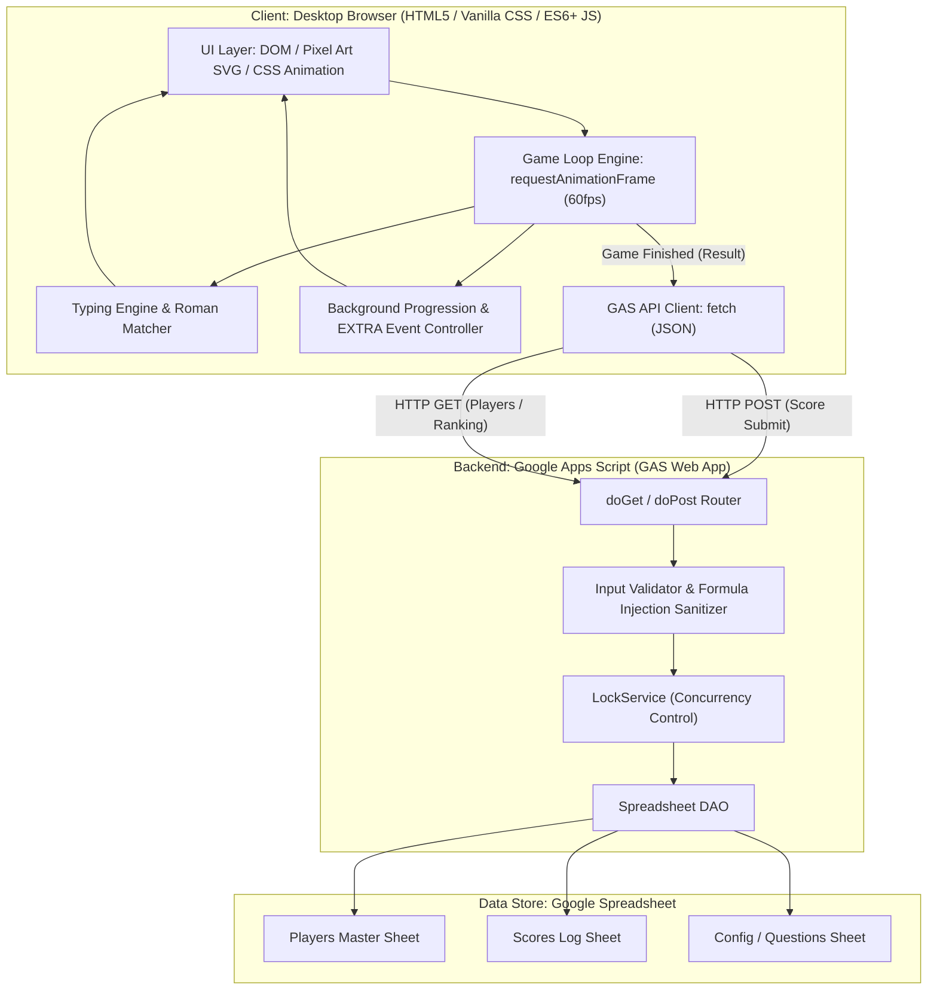

# 03_architecture.md — 基本設計・アーキテクチャ設計書

## 1. システム全体構成 (System Architecture)

本システムは、ブラウザ側で完結する高レスポンスな2Dタイピングゲームフロントエンドと、スコア永続化およびランキング集計を担当するGoogle Apps Script (GAS) バックエンド、およびGoogle Spreadsheetデータストアで構成される。



---

## 2. 責務境界 & 通信プロトコル (Responsibility Boundary & Protocol)

### 2.1 レイヤー別責務分担

| レイヤー | 実行ホスト / 基盤 | 担当責務 | 厳禁事項 |
| :--- | :--- | :--- | :--- |
| **Frontend** | PCブラウザ (Chrome / Edge / Firefox) | ・60fps ゲームループ描画<br>・Keydown直接捕捉 & ローマ字判定<br>・フォークリフト・資材・車両アニメーション<br>・背景建設 & EXTRA演出制御<br>・タイマー、コンボ、スコアのローカル計算 | ・1キー入力ごとの通信<br>・Spreadsheetへの直接アクセス<br>・フレーム単位の重いDOM生成破棄 |
| **Backend (GAS)** | Google Apps Script (V8 Engine) | ・`doGet`: 初期マスター（Players/Questions/Config）、ランキングデータ返却<br>・`doPost`: スコア登録受付、パラメータ検証、数式エスケープ、LockService排他制御 | ・常時リアルタイムWebSocket通信<br>・重い物理演算やグラフィックス処理 |
| **Data Store** | Google Spreadsheet | ・Players マスタ保存<br>・Scores 履歴の追記保存（監査・履歴保持）<br>・ランキング算出元データ | ・クライアントへの無制限公開 |

### 2.2 API 通信仕様 (JSON Endpoints)

#### A. 初期マスター取得 (`GET ?action=getMasterData`)
* **Request**: `GET https://script.google.com/macros/s/{DEPLOY_ID}/exec?action=getMasterData`
* **Response**:
```json
{
  "success": true,
  "players": [
    { "id": "PL-001", "name": "足場 太郎", "department": "機材管理部" },
    { "id": "PL-002", "name": "現場 次郎", "department": "安全推進部" }
  ],
  "questions": [
    { "id": "Q-001", "difficulty": "beginner", "displayText": "支柱", "reading": "しちゅう", "defaultRoman": "SHICHUU" }
  ],
  "serverTime": "2026-09-02T11:00:00Z"
}
```

#### B. スコア登録 (`POST ?action=submitScore`)
* **Request**: `POST https://script.google.com/macros/s/{DEPLOY_ID}/exec`
* **Payload**:
```json
{
  "action": "submitScore",
  "playerId": "PL-001",
  "playerName": "足場 太郎",
  "difficulty": "intermediate",
  "score": 12500,
  "correctCount": 15,
  "typedCharacters": 120,
  "missCount": 3,
  "accuracy": 97.56,
  "maxCombo": 18,
  "playDuration": 90,
  "appVersion": "1.0.0"
}
```
* **Response**:
```json
{
  "success": true,
  "scoreId": "SC-20260902-110001",
  "rankMonthly": 2,
  "rankAllTime": 5,
  "message": "スコアを正常に登録しました。"
}
```

#### C. ランキング取得 (`GET ?action=getRankings&difficulty=intermediate&period=monthly`)
* **Request**: `GET https://script.google.com/macros/s/{DEPLOY_ID}/exec?action=getRankings&difficulty=intermediate&period=monthly`
* **Response**:
```json
{
  "success": true,
  "period": "monthly",
  "difficulty": "intermediate",
  "rankings": [
    { "rank": 1, "playerId": "PL-003", "playerName": "積込 花子", "score": 14200, "accuracy": 99.1, "playedAt": "2026-09-01T15:20:00Z" },
    { "rank": 2, "playerId": "PL-001", "playerName": "足場 太郎", "score": 12500, "accuracy": 97.56, "playedAt": "2026-09-02T11:00:00Z" }
  ]
}
```

---

## 3. ゲーム状態遷移 & エンジン構造 (State Machines)

### 3.1 ゲーム全体ライフサイクル状態マシン
```text
[INIT] ──(マスター取得完了)──> [READY_TITLE]
                                      │
                         (プレイヤー&難易度選択)
                                      ▼
                               [COUNTDOWN (3..2..1)]
                                      │
                                      ▼
                                [PLAYING_ACTIVE] ──(中断)──> [READY_TITLE]
                                      │
                              (時間切れ / 練習終了)
                                      ▼
                                [GAME_OVER_RESULT]
                                      │
                         (スコア送信 / ランキング確認)
                                      ▼
                                [RANKING_VIEW] ──(閉じる)──> [READY_TITLE]
```

### 3.2 1問単位のタイピング & 走行アニメーション状態マシン
```text
[SPAWN_QUESTION] ──(フォークリフト走行開始)──> [DRIVING_FORWARD]
                                                     │
               ┌─────────────────────────────────────┴─────────────────────────────────────┐
               ▼                                                                           ▼
      (トラック到達前に入力完了)                                                   (入力前にトラック到達)
               ▼                                                                           ▼
       [SUCCESS_LIFTING]                                                           [MISS_COLLISION]
               │                                                                           │
        (荷台移動 250ms)                                                            (車体振動 200ms)
               ▼                                                                           ▼
       [SUCCESS_POPUP] (200ms)                                                     [MISS_DROP_PENALTY] (300ms)
               │                                                                           │
               └─────────────────────────────────────┬─────────────────────────────────────┘
                                                     ▼
                                            [SPAWN_NEXT_QUESTION]
```

### 3.3 ローマ字入力マッチング状態エンジン (Prefix-tree Matcher)
* 出題単語のひらがな文字列をモーラ（拍）単位のノードツリーに分解。
* プレイヤーが入力したキーシーケンスに応じて、許容される複数のローマ字遷移パスを追跡。
* 例: 「し」に対して `s` 入力 ➔ 次は `h` または `i` が有効ノード。`s` ➔ `i` で確定。

---

## 4. セキュリティ & 整合性設計 (Security & Integrity)

1. **Spreadsheet Formula Injection 対策**:
   - プレイヤー名、問題文、テキストデータが `=`, `+`, `-`, `@` で始まる場合、先頭にシングルクォート `'` を付与して無害化してからSpreadsheetへ格納。
2. **GAS 側パラメータ検証**:
   - `score`, `correctCount`, `missCount`, `accuracy`, `playDuration` の型および上限・下限範囲チェック（例: `accuracy` は 0〜100、負のスコアや異常値の排除）。
3. **LockService による排他制御**:
   - `doPost` 処理開始時に `LockService.getScriptLock().waitLock(10000)` を実行し、複数クライアントからの同時スコア送信による行上書き競合を完全に防止。
4. **CORS 対応**:
   - GAS Web Appのレスポンスに `ContentService.createTextOutput().setMimeType(ContentService.MimeType.JSON)` を適用し、Webブラウザからの `fetch` 通信を正常完了させる。

---

## 5. モジュール & ディレクトリ構成 (Directory & Module Structure)

```text
base-typing-game/
├── .github/
│   └── workflows/
│       └── deploy.yml              # GitHub Pages 自動デプロイ設定
├── docs/                           # プロジェクト公式ドキュメント
├── src/
│   ├── index.html                  # メインHTMLエントリポイント
│   ├── index.css                   # Pixel Artデザインシステム・レイアウトスタイル
│   ├── main.js                     # アプリケーション初期化・画面ルーティング
│   ├── config/
│   │   └── gameConfig.js           # ゲームバランス・難易度・背景進化設定
│   ├── data/
│   │   └── defaultQuestions.js     # オフライン・初期ロード用問題マスター
│   ├── engine/
│   │   ├── gameEngine.js           # 60fps ゲームループ・タイマー・スコア制御
│   │   ├── typingMatcher.js        # ローマ字揺れ判定・タイピング入力パーサー
│   │   └── animationController.js  # フォークリフト・資材・背景進化アニメーション
│   ├── assets/
│   │   ├── pixelSprites.js         # 車両・資材・ランドマークのSVG/Pixel定義
│   │   └── extraEffects.js         # EXTRAステージ動的演出 (飛行機・ヘリ・風船等)
│   ├── services/
│   │   └── gasApiClient.js         # GAS通信 (マスター取得・スコア送信・ランキング)
│   └── gas/
│       ├── Code.js                 # GASバックエンド (doGet / doPost / DAO)
│       └── appsscript.json         # GASプロジェクト設定マニフェスト
├── ai-project.yml                  # AI Development Core Manifest
├── AGENTS.md                       # AI Agent Bootstrap Router
└── README.md                       # プロジェクト概要・操作説明
```

---

## 6. Architecture Feasibility Grounding (実現可能性の根拠)

本アーキテクチャの実現可能性は、以下の環境SSOTおよび技術基盤により担保される。

1. **executionHost**:
   - クライアント: デスクトップPC標準Webブラウザ（Chrome / Edge）。OSネイティブのWeb描画ホスト上でHTML5/CSS/JavaScriptが動作。
   - バックエンド: Google Apps Script クラウドインフラストラクチャ（Google V8 Runtime）。
2. **runtimeBasis**:
   - フロントエンド: HTML5, Vanilla CSS3, ES6+ JavaScript, `window.requestAnimationFrame`, `window.addEventListener('keydown')`, `fetch` API。
   - バックエンド: Google Apps Script V8 Engine (`SpreadsheetApp`, `LockService`, `ContentService.MimeType.JSON`, `Utilities`).
3. **persistenceMechanism**:
   - フロントエンドから `gasApiClient.js` が `fetch(GAS_ENDPOINT, { method: 'POST', body: JSON.stringify(...) })` を実行。
   - GAS `Code.js` が `LockService` を取得し、`SpreadsheetApp.openById().getSheetByName('Scores').appendRow([...])` によりGoogleスプレッドシートの行として永続化。
4. **capabilityMapping**:
   - [FR-001] ゲームループ ➔ `gameEngine.js` (`requestAnimationFrame`)
   - [FR-002] タイピング判定 ➔ `typingMatcher.js` (`keydown` リスナー & モーラ木探索)
   - [FR-003, FR-004] 成功/失敗演出 ➔ `animationController.js` (CSS Transform & SVG Sprite)
   - [FR-005, FR-006] 難易度・モード ➔ `gameConfig.js` & `main.js`
   - [FR-007, FR-008, FR-009] 資材・背景・EXTRA ➔ `pixelSprites.js` & `extraEffects.js`
   - [FR-010, FR-011] スコア・コンボ ➔ `gameEngine.js` (確定計算式)
   - [FR-012, FR-013, FR-015] ランキング・プレイヤー・GAS ➔ `gasApiClient.js` & `gas/Code.js`
   - [FR-014, FR-016] 問題データ・Config ➔ `defaultQuestions.js` & `gameConfig.js`
